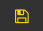

# Mocking an API Request

Now that you know how to create your first project, create your first advanced request mock.

## Create a new endpoint

Click the
 **Plus(+)** Button on the Action Bar and add an endpoint to the project. In the application, you can edit an endpoint on the list with _edit description_.

Click on an item in the list to see an endpoint's details.

The first thing you'll want to set is the path. Enter a path in the input field and be sure to save it. You can save the path in two ways:

- pressing the "enter" key
- clicking the  save icon

The new path value will now be visible in the list (see below):

Click on the relevant method you'd like to use for your endpoint (see below):

To demonstrate all the advantages of making requests in the Mimic app, this chapter has two parts. In the first part, we explain how to create a [**GET**](#get) request with URL parameters. In the second part, we'll explain how to create a [**POST**](#post) request with a body.

### GET

Setting _URL parameters_ is easy. You type them into the input field provided.

To test that everything is working, you can open the Terminal on your computer and run the following command (provided the server is running on port 3002):

`curl http://localhost:3002/project/refresh?name=natalia`

[More Info](http://www.codingpedia.org/ama/how-to-test-a-rest-api-from-command-line-with-curl/)

You should be able to see the incoming request logged in the _Logs_ section:

### POST

In Post method you have body field visible

When creating a POST method, you can edit the body input directly. Simply add the body as JSON, and if the structure is valid JSON, you will see a green icon in the top-right corner of the POST body input.

Additionally, the Mimic app allows you to make requests with a Raw body. This is done by switching the toggle from JSON to RAW.

To remove your endpoint, click _Delete Endpoint_ from the hamburger menu (see below):

That's basically it about creating a request mock. We hope you found what you were looking for! If not, you might want to check related documentation sections:

- [Create first project](basics/create-first-project.md)
- [Response options](basics/response-options.md)

Or you can just contact useand we'll do our best to help you!
