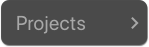

# Navigating Mimic

Mimic is a single-window application. The interface is divided into four main parts:

- **[Action Bar](#action-bar)**
- **[Endpoints](#endpoints)**
- **[Logs](#logs)**
- **[Status bar](#status-bar)**

Every part of the application was designed to give you enough space for showing all the necessary information.

## Action Bar

On the Action Bar, the following options are available:

-  **Projects** Button - Create a new project, switch between projects.

-  **Start Server** Button - Starts or stops the background server for mocking requests.

-  **Edit** Icon - Edit the project name.

-  **Plus(+)** Button - Add an endpoint to the project.

-  **Menu** Button - Projects settings, delete all endpoints, delete project.

## Endpoints

You can see a list of endpoints. Every endpoint contains a description, method, type and endpoint path.

### Endpoints Details

When you clicks on an item in the endpoints list, the Side Bar is shown with details about the selected endpoint.

### Side Bar - Endpoints Details

The Side Bar has four main parts:

- **[Endpoint Details Action Bar](#endpoint-details-action-bar)** - Settings for the endpoint.
- **[Path](#path)** - Input where you can set an endpoint path.
- **[Request](#request)/[Response](#response)** - Two buttons let you switch between Request and Response options.
- **[Methods and Body](#request)** - Depends on the **Request/Response** buttons.

#### Endpoint Details Action Bar

The Action Bar contains:

-  **Menu Button** - Allow you to delete an endpoint.

-  **Save Icon** - Allow you to save endpoint details, making it active after every change.
-  **Close Icon** - Closes the endpoint details.

#### Path

You can type the endpoint path and save it using _Enter_ or _Save Icon_.

#### Request

The Request content contains the method buttons - GET, POST, PUT, PATCH and DELETE.

Three methods - POST, PUT and PATCH - allow you to set the **Body**:

- JSON - The JSON body automatically saves and checks for valid syntax.
- RAW - The RAW request body can be saved using the _Save Icon_.

\*App serves the currently selected body type.

Two methods - GET and DELETE - allow you to set **URL Parameters**.

#### Response

You can set the following on a response:

- **HTTP Status Code** (more info: [HTTP Status Codes](https://www.w3.org/Protocols/rfc2616/rfc2616-sec10.html)).
- **Delay** - Set a response delay (in milliseconds).
- **Body type** - Switch body type (JSON or RAW).

\*App serves the currently selected body type.

## Logs

The Logs section allows you to see the messages from the server. These are meant to let you monitor the changes in your server status (stop/start cycles) as well as any requests that are made to the mock server, along with their status codes and possible parameters.

If you prefer to save predefined requests using responses from a real-life server, the Logs section is the place to go. The project can be configured [Create first project](basics/create-first-project.md) to forward any requests not handled by the local _mock server_ to a fallback server. Such requests will appear in the Logs list with a green Mock button on the right. Clicking it will automatically save the path and parameters of the given endpoint along with the response from the fallback server.

Clicking the _Garbage Icon_  will clear all logs.

## Status Bar

The Status Bar represents the current status of the server that we run in the background to mock all the defined requests.
